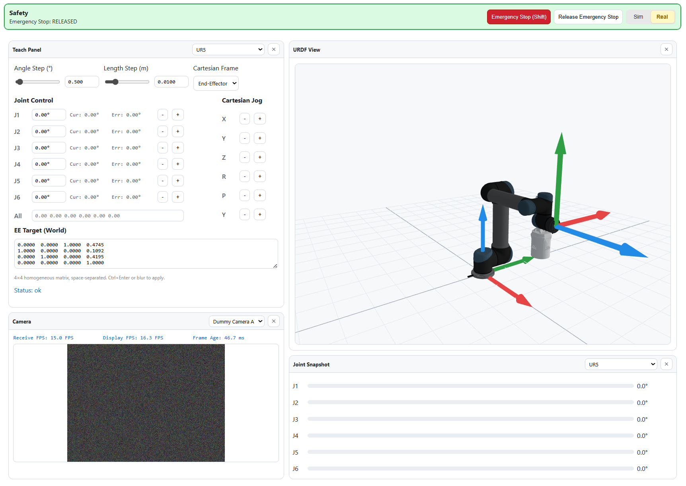

# Online Robot Controller

[](https://github.com/Soappyooo/OnlineRobotController/stargazers)
[](LICENSE)
[](https://www.python.org/)
[](https://nodejs.org/)

[简体中文](README.zh-CN.md)

Online Robot Controller is an open-source web UI for robot monitoring, teleoperation, camera streaming, and URDF-based visualization. It keeps robot-specific code inside backend plugins so you can reuse the same operator interface across simulation, demo setups, and real hardware integrations.

<p align="center">
	
</p>

## ✨ Highlights

- Plugin-driven backend with hot-swappable robot adapters
- Unified joint-space, cartesian-space, camera, and safety APIs
- Built-in simulation flow for UI and plugin development without hardware
- Runtime URDF visualization in the browser
- Public example plugins for both the minimum contract and a fuller reference implementation

## 🚀 Get Started

### 1. Install prerequisites

- Python 3.11
- `uv` or `pip`
- Node.js LTS
- `npm`

### 2. Install backend dependencies

With `uv`:

```powershell
cd backend
uv sync
```

With `pip`:

```powershell
cd backend
python -m pip install -r requirements.txt
```

### 3. Install frontend dependencies

```powershell
cd frontend
npm install
```

### 4. Start the project

Backend with `uv`:

```powershell
cd backend
uv run uvicorn app.main:app --host 0.0.0.0 --port 8100 --reload
```

Backend with `pip`:

```powershell
cd backend
python -m uvicorn app.main:app --host 0.0.0.0 --port 8100 --reload
```

Frontend:

```powershell
cd frontend
npm run dev
```

Then open:

- App: http://127.0.0.1:5180
- API docs: http://127.0.0.1:8100/docs

### 5. Start by playing around

The repository already includes public example plugins:

- `mock`: the smallest useful reference implementation
- `ur5_shadow`: a richer example with virtual hardware, cameras, and custom IK

Launch the app, keep the default example plugin, and explore the interface before you write any code.

## 🎮 Using the Interface

▶ Usage demo: [example_usage.mp4](assets/readme_assets/example_usage.mp4)

The main screen is organized around a dashboard of movable panels:

- The `+` button at the top-left adds a new panel.
- Every panel can be resized, dragged to a new position, and closed.
- The settings entry at the bottom-left lets you switch configs and edit config content.
- The safety strip across the top contains the emergency-stop controls.
- Press the emergency-stop button or use `Shift` to trigger an emergency stop.
- Use the neighboring release button to clear the emergency stop.
- The controls at the far right switch between simulation and real mode.
- The rest of the page is made up of the working panels, such as Teach Panel, URDF View, Camera, and Joint Snapshot.

If you are new to the project, the fastest way to understand it is:

1. Start the backend and frontend.
2. Open the app and add a few panels.
3. Resize and move them until the layout feels natural.
4. Toggle between simulation and real mode using the top-right controls.
5. Open settings in the bottom-left and inspect the active configuration.

## 🧩 Write Your Own Plugin

When you are ready to integrate your own robot, start from the built-in examples in `backend/app/plugins/`.

Recommended path:

1. Copy `backend/app/plugins/mock/` if you want the smallest possible starting point.
2. Copy `backend/app/plugins/ur5_shadow/` if you want a more complete reference with cameras and custom IK.
3. Rename the folder and update its `config.toml`.
4. Implement the real-mode hooks in your plugin class.

The main hooks plugin authors typically override are:

- `get_joint_states(chain_id) -> list[float]`
- `set_joint_targets(chain_id, target_angles_deg) -> None`
- `get_estop() -> bool`
- `set_estop(trigger) -> None`
- `get_ee_pose(chain_id) -> np.ndarray`
- `set_ee_pose_target(chain_id, se3_target_in_world) -> None`
- `get_real_camera_frame(camera_id) -> tuple[str, float] | None`
- `get_camera_receive_fps(camera_id) -> float`
- `on_mode_enter_real() -> str`
- `on_mode_exit_real() -> None`

Plugins are auto-discovered from `backend/app/plugins/<plugin_name>/config.toml`, so the normal workflow is to add a new plugin folder, wire up its config, and then iterate inside that single directory.

## 🧪 Validate Your Changes

Backend:

```powershell
cd backend
uv run pytest -q
```

Frontend:

```powershell
cd frontend
npm run test
npm run build
```

## 📁 Repository Layout

- `backend/`: FastAPI backend, plugin system, and backend tests
- `frontend/`: React + TypeScript + Three.js operator interface
- `assets/ur5_shadow_example/`: public URDF and mesh assets used by the example plugin
- `assets/readme_assets/`: screenshot and usage media for the README

## 📄 License and Third-Party Assets

The project source code is released under the MIT License.

Example robot assets under `assets/ur5_shadow_example/` include third-party material with their own notices:

- `assets/ur5_shadow_example/urdf/ur5.urdf`: marked as MIT-licensed in the source file header
- `assets/ur5_shadow_example/urdf/shadow_hand_right.urdf`: BSD-licensed Shadow Robot description
- `assets/ur5_shadow_example/urdf/ur5_shadow.urdf`: combined asset that keeps the upstream notices in place

See `THIRD_PARTY_NOTICES.md` for the consolidated notice text.
